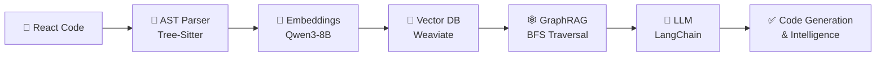

# 🚀 Internship AI Project - GraphRAG Code Intelligence System

<div align="center">


### 🎯 An End-to-End Retrieval-Augmented Generation (RAG) Pipeline for Code Intelligence

*Built during internship at **Zoho Corporation***

[📖 Documentation](#documentation) • [⚡ Quick Start](#setup-instructions) • [🏗️ Architecture](#architecture--workflow)

</div>

---

## 📋 Project Overview

This repository showcases an **advanced code intelligence system** developed during my **35-day internship at Zoho Corporation**. The project implements a cutting-edge **GraphRAG (Graph-based Retrieval-Augmented Generation)** pipeline that enables:

✨ **Semantic code search** across React projects  
🔗 **Dependency-aware retrieval** using graph traversal algorithms  
🤖 **AI-powered code generation** with contextual understanding  
🌳 **AST-based structural analysis** for accurate code parsing  

### 🎯 Key Objectives

- Design and implement an end-to-end RAG pipeline for code intelligence
- Model React component dependencies using graph-based structures
- Enable efficient retrieval of code components with their dependencies
- Integrate modern AI tools for semantic understanding and generation

---

## 🏗️ Architecture & Workflow



### 🔄 Pipeline Components

#### 1️⃣ **AST Parsing** 🌳
- Parses React code into **Abstract Syntax Trees (AST)** using **Tree-Sitter**
- Provides accurate structural representation of code components
- Captures syntax, dependencies, and hierarchical relationships

#### 2️⃣ **Semantic Embeddings** 🧠
- Generates high-quality embeddings using **Qwen3-Embedding-8B**
- Transforms code and AST structures into dense vector representations
- Enables robust semantic similarity search

#### 3️⃣ **Vector Storage** 💾
- Stores embedded objects in **Weaviate vector database**
- Maintains graph references to model component dependencies
- Supports efficient similarity search and retrieval

#### 4️⃣ **Graph Retrieval (GraphRAG)** 🕸️
- Implements **Breadth-First Search (BFS)** for dependency traversal
- Retrieves components with full contextual dependencies
- Enables intelligent, context-aware code queries

#### 5️⃣ **LLM Integration** 🤖
- Uses **LangChain** as bridge to large language models
- Facilitates code generation with retrieved context
- Enables natural language queries for code intelligence

---

## ✨ Key Features

| Feature | Description |
|---------|-------------|
| 🔍 **Semantic Search** | Natural language queries to find relevant code components |
| 🕸️ **Dependency Mapping** | Graph-based modeling of React component relationships |
| 🎯 **Context-Aware Retrieval** | BFS traversal ensures all dependencies are included |
| 🤖 **AI-Powered Generation** | LLM integration for intelligent code generation |
| 🔧 **Extensible Design** | Easy integration with other embedding models and codebases |
| ⚡ **Production-Ready** | Best-in-class AI frameworks (Weaviate, Qwen, LangChain) |

---

## 🛠️ Technologies Used

<div align="center">

| Category | Technology | Purpose |
|----------|------------|----------|
| 🐍 **Language** | Python 3.9+ | Core development language |
| 💾 **Vector DB** | Weaviate | Efficient vector storage & retrieval |
| 🧠 **Embedding Model** | Qwen3-Embedding-8B | High-quality code embeddings |
| 🌳 **Parser** | Tree-Sitter | AST generation for JS/JSX |
| 🤖 **LLM Framework** | LangChain | Prompt engineering & LLM integration |
| 🐳 **Containerization** | Docker | Local development & testing |
| 💻 **IDE** | Visual Studio Code | Development environment |

</div>

---

## ⚡ Setup Instructions

### 📦 Prerequisites

- Python 3.9 or higher
- Docker (for Weaviate)
- Git

### 🚀 Quick Start

1️⃣ **Clone the repository**
```bash
git clone https://github.com/Varshan-N/Internship-AI-Project.git
cd Internship-AI-Project
```

2️⃣ **Set up Weaviate instance**
```bash
# Using docker-compose
docker-compose -f docker-compose1.yml up -d
```

3️⃣ **Install Python dependencies**
```bash
pip install -r requirements.txt
# Key packages: weaviate-client, langchain, tree-sitter, transformers
```

4️⃣ **Run pipeline scripts**
```bash
# Parse React code to AST
python react_ast.py

# Build dependency graph
python ast_relationship.py

# Initialize Weaviate and embed code
python weviatedb.py
```

5️⃣ **Query and generate!** 🎉

---

## 📂 Project Structure

```
Internship-AI-Project/
├── 📄 react_ast.py          # AST parsing logic
├── 📄 ast_relationship.py   # Dependency graph builder
├── 📄 weviatedb.py          # Weaviate integration
├── 📄 docker-compose1.yml   # Weaviate setup
├── 📄 README.md             # This file
└── 📁 docs/                 # Additional documentation
```

---

## 🎓 Internship Context

**Organization:** [Zoho Corporation](https://www.zoho.com/)  
**Duration:** 35 days  
**Focus Areas:**
- 🏭 Production-level AI retrieval systems
- 📊 Graph algorithms for code intelligence
- 🛠️ Developer tooling and automation
- 🤖 Integration of LLMs for code generation

### 🏆 Key Learnings

- ✅ Designed and implemented scalable RAG pipelines
- ✅ Gained expertise in vector databases (Weaviate)
- ✅ Mastered graph algorithms (BFS) for dependency resolution
- ✅ Integrated state-of-the-art embedding models
- ✅ Built production-ready AI systems

---

## 📖 Documentation

### 🔍 How It Works

1. **Input**: React project source code
2. **Parsing**: Tree-Sitter extracts AST structures
3. **Embedding**: Qwen3 generates semantic vectors
4. **Storage**: Weaviate stores vectors with graph metadata
5. **Query**: Natural language or code queries
6. **Retrieval**: GraphRAG fetches relevant components + dependencies
7. **Generation**: LangChain + LLM produces intelligent outputs

### 🎯 Use Cases

- 📝 **Code Documentation**: Auto-generate docs from codebase
- 🔍 **Component Discovery**: Find reusable components semantically
- 🐛 **Dependency Analysis**: Understand component relationships
- 🤖 **Code Generation**: Generate code with proper context
- 📊 **Code Intelligence**: Answer questions about codebases

---

## 🚀 Future Enhancements

- [ ] 🌐 Support for additional languages (TypeScript, Python, Go)
- [ ] 📊 Advanced visualization of dependency graphs
- [ ] 🔄 Real-time code indexing and incremental updates
- [ ] 🎨 Web UI for interactive code exploration
- [ ] 📈 Performance optimization for large codebases
- [ ] 🔌 Plugin architecture for custom embeddings

---

## 🤝 Contributing

While this is a personal internship project, feedback and suggestions are welcome!

---

## 📄 License

This project is licensed under the **MIT License** - see the LICENSE file for details.

---

## 📬 Contact

**Varshan N**  
📧 Email: [Contact via GitHub](https://github.com/Varshan-N)  
💼 LinkedIn: [Connect with me](https://www.linkedin.com/in/me/)  
🐙 GitHub: [@Varshan-N](https://github.com/Varshan-N)

---

<div align="center">

### ⭐ If you find this project interesting, please consider starring the repository!

**Made with ❤️ during internship at Zoho Corporation**


</div>
